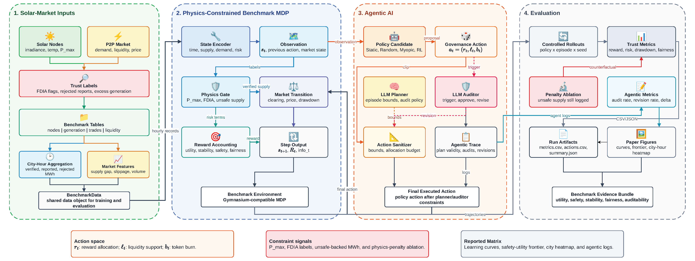

<h2 align="center">SolarChain-Eval: A Physics-Constrained Benchmark for Trustworthy Economic Agents in Decentralized Energy Markets</h2>

<p align="center">
  <b>Shilin Ou</b><sup>1,*</sup> &nbsp;&bull;&nbsp;
  <b>Yifan Xu</b><sup>1,*</sup> &nbsp;&bull;&nbsp;
  <b>Luyao Zhang</b><sup>1</sup>
</p>

<p align="center">
  <sup>1</sup>Duke Kunshan University &nbsp;&bull;&nbsp;
  <sup>*</sup>Equal contribution
</p>

<p align="center">
  Accepted at the <a href="https://kdd-eval-workshop.github.io/agenticai-evaluation-kdd2026/">KDD Workshop on Evaluation and Trustworthiness of Agentic AI 2026</a>
</p>

<p align="center">
  <a href="https://openreview.net/forum?id=XcWTS5iVvY"></a>
  <a href="https://github.com/yxu-dev/SolarChain-Eval"></a>
  <a href="https://huggingface.co/datasets/ThomasXu/solarchain-eval"></a>
  <a href="LICENSE"></a>
</p>

<p align="center">
  
</p>

## Abstract

SolarChain-Eval is a physics-constrained benchmark for evaluating trustworthy economic agents in decentralized peer-to-peer solar energy markets. It formulates market governance as a Gymnasium-compatible Markov Decision Process where agents make hourly decisions over reward allocation, liquidity support, and token burning. The benchmark evaluates policies across market utility, physical safety, slippage, action smoothness, spatial fairness, and auditability. It also includes an evaluation-only LLM Planner/Auditor layer that defines episode-level action bounds, triggers audits under risk signals, revises high-risk actions, and records structured intervention traces. Experiments with static, random, myopic, RL, and RL+LLM policies show a clear utility-safety trade-off: RL agents can improve economic utility, but reward-maximizing behavior may exploit invalid generation and inflate artificial liquidity when physics penalties are removed. The agentic governance layer improves auditability and mitigates selected risks, but it cannot fully compensate for a misspecified reward. SolarChain-Eval therefore emphasizes that trustworthy agentic AI evaluation in cyber-physical markets requires both physical constraints and transparent intervention records.

## Motivation

Agentic AI systems are increasingly applied to cyber-physical and economic settings where actions affect physical resources, market incentives, and system safety. Decentralized energy markets are a representative case: autonomous policies may improve liquidity and trading efficiency, but their decisions remain bounded by localized irradiance, photovoltaic capacity, verified generation, and false-data injection risk.

This creates a central evaluation problem: scalar reward is not enough. A reward-maximizing policy may improve apparent market utility by economically backing invalid or physically impossible generation. Under false-data injection attacks, this behavior can create artificial liquidity and degrade market integrity even when cumulative reward increases.

SolarChain-Eval evaluates autonomous market policies under this utility-safety tension. At each hour, an agent controls:

- reward allocation between producers and the liquidity pool,
- liquidity support,
- token burn rate.

The benchmark evaluates these decisions across market utility, physical safety, market stability, action smoothness, spatial fairness, and auditability.

## Benchmark Design

SolarChain-Eval connects solar generation, peer-to-peer market activity, physics labels, policy rollouts, and trustworthiness evidence in one reproducible benchmark loop.

The environment is implemented as a Gymnasium-compatible MDP:

```text
src/solarchain_eval/env.py
```

Each episode represents a 24-hour market cycle sampled from the April 2026 dataset. The state includes time, verified and reported generation, physical PV limits, supply-demand gap, liquidity, token price, physics-risk signals, static-market slippage, and the previous action. The action is:

```text
(reward_ratio, liquidity_ratio, burn_rate)
```

The benchmark uses an action sanitizer and allocation budget so executed actions remain within market constraints.

The accepted-paper configuration uses a five-city dataset:

```text
configs/month_2026_04.yaml
data/datasets_2026_04_month/
```

Dataset summary:

- Cities: Beijing, Shanghai, Chengdu, Shenzhen, Hangzhou
- Energy nodes: 50
- Period: 2026-04-01 to 2026-04-30
- Hourly market states: 720
- Generation records: 36,000

The benchmark compares:

- Static 1:3 split
- Random
- Myopic Greedy
- PPO
- SAC
- DQN with a discretized action grid

The evaluation suite has three main settings:

- Main benchmark: evaluates all policies under the physics-constrained reward.
- Reward ablation: removes the physics penalty while still logging physical violations and artificial liquidity.
- Agentic evaluation: inserts an LLM-based governance layer between trained RL policies and the environment during evaluation only.

Together, these settings expose the paper's main finding: learned RL policies can improve economic utility, but reward optimization alone can introduce unsafe market behavior. Physics constraints and transparent intervention traces are both needed to evaluate whether an autonomous economic agent is not only profitable, but also verifiable and physically grounded.

## Agentic Planner/Auditor Layer

The optional agentic layer is active only during evaluation and is never used during PPO, SAC, or DQN training. It contains:

- LLM Planner
- LLM Auditor
- Rule Planner/Auditor baselines

The Planner defines episode-level action bounds and audit rules. The Auditor is invoked under risk triggers and can approve or revise high-risk actions before the environment step. Structured logs record trigger signals, proposed actions, revised actions, action deltas, and audit rationales.

This layer is intended as an auditable risk-control interface, not as a replacement for a correctly specified physics-constrained reward. The paper's ablation results show that LLM governance can mitigate selected risks and make interventions traceable, but it cannot fully compensate when reward maximization is allowed to ignore physical constraints.

## Dataset Hosting

The dataset is hosted on Hugging Face Datasets:

```text
https://huggingface.co/datasets/ThomasXu/solarchain-eval
```

The GitHub repository keeps a small data mirror for lightweight reproducibility:

```text
data/datasets_2026_04_month/
data/datasets/
```

The Hugging Face release includes the dataset card, dataset license, summary, checksums, main monthly CSVs, smoke CSVs, and the Open-Meteo cache.

## Setup

```bash
conda activate SolarChain-rl
python -m pip install -r requirements.txt
python -m pip install -e .
```

## Quick Smoke Run

```bash
python scripts/evaluate.py \
  --config configs/month_2026_04.yaml \
  --policies "static,random,myopic" \
  --episodes 1

python scripts/make_figures.py \
  --config configs/month_2026_04.yaml \
  --run-dir outputs/runs/<timestamp>_eval
```

## Framework CLI

SolarChain-Eval can also be used directly as a benchmark framework without running the full artifact pipeline. All commands below should be run from the repository root after activating the environment.

Generate or refresh a five-city monthly dataset:

```bash
python scripts/generate_monthly_datasets.py \
  --start-date 2026-04-01 \
  --end-date 2026-05-01 \
  --output-dir data/datasets_2026_04_month \
  --seed 20260511
```

Train one RL baseline:

```bash
python scripts/train.py \
  --config configs/month_2026_04.yaml \
  --algo ppo \
  --timesteps 100000 \
  --output-dir outputs/runs \
  --run-name ppo_train
```

Run the built-in baseline suite:

```bash
python scripts/run_all_baselines.py \
  --config configs/month_2026_04.yaml \
  --timesteps 100000 \
  --episodes 10 \
  --output-dir outputs/runs \
  --run-name main
```

Run the no-physics-penalty ablation:

```bash
python scripts/run_all_baselines.py \
  --config configs/month_2026_04.yaml \
  --timesteps 100000 \
  --episodes 10 \
  --output-dir outputs/runs \
  --run-name no_physics_penalty \
  --no-physics-penalty
```

Evaluate selected policies, optionally using trained models:

```bash
python scripts/evaluate.py \
  --config configs/month_2026_04.yaml \
  --policies "static,random,myopic,ppo" \
  --episodes 10 \
  --ppo-model outputs/runs/main/models/ppo/ppo_model.zip \
  --output-dir outputs/runs \
  --run-name eval_selected
```

Run the evaluation-only planner/auditor layer with rule components:

```bash
python scripts/evaluate.py \
  --config configs/month_2026_04.yaml \
  --policies "ppo,sac,dqn" \
  --episodes 10 \
  --ppo-model outputs/runs/main/models/ppo/ppo_model.zip \
  --sac-model outputs/runs/main/models/sac/sac_model.zip \
  --dqn-model outputs/runs/main/models/dqn/dqn_model.zip \
  --output-dir outputs/runs \
  --run-name agentic_rule_rule \
  --agentic-mode planner_auditor \
  --planner rule \
  --auditor rule \
  --audit-trigger event \
  --save-agentic-logs
```

For LLM planner/auditor runs, configure an OpenAI-compatible endpoint first:

```bash
export SOLARCHAIN_LLM_API_KEY="..."
export SOLARCHAIN_LLM_BASE_URL="https://..."
export SOLARCHAIN_LLM_MODEL="..."
```

Then replace `--planner rule --auditor rule` with:

```bash
--planner llm --auditor llm
```

Generate figures for any completed run:

```bash
python scripts/make_figures.py \
  --config configs/month_2026_04.yaml \
  --run-dir outputs/runs/main \
  --figures-dir figures/main
```

Use `--help` on any script to inspect the full argument list, for example:

```bash
python scripts/evaluate.py --help
```

## Reproducibility

The authoritative reproducibility guide is:

```text
artifact_pipeline/README.md
```

It documents the official Linux artifact pipeline, output layout, resume guidance, metrics, figures, and acceptance checks. If any detail in this root README conflicts with `artifact_pipeline/README.md`, use `artifact_pipeline/README.md` as the source of truth.

